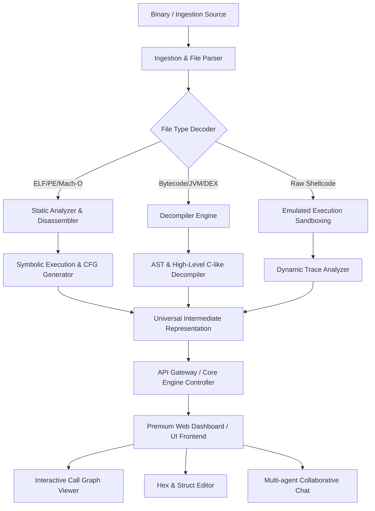

# 🌌 Universal Reverse Engineering Tool (URET)

A next-generation, premium web-based workbench designed for security researchers, malware analysts, and reverse engineers. Built for speed, visual clarity, and multi-threaded analytical workflows.

---

## 🛠️ Architecture Flowchart

Below is the conceptual high-level architecture of URET, illustrating how files flow from binary ingestion through our disassembler and analysis engines to the interactive visual frontend.



---

## ✨ Features Breakdown

### 1. Unified Binary Ingestion & Parsing
*   **Multi-Format Loader:** Built-in support for executable formats including **PE (Windows)**, **ELF (Linux)**, **Mach-O (macOS)**, and raw shellcode.
*   **Automatic Metadata Extraction:** Extracts headers, section configurations, imports/exports, dynamic libraries, and compilation footprints immediately on upload.

### 2. High-Performance Static Disassembly & Decompilation
*   **Control Flow Graph (CFG) Reconstruction:** Renders beautiful interactive visual flowcharts showing jumps, branches, loops, and block execution paths.
*   **Interactive Type and Symbol Renaming:** Rename variables, structs, and functions globally in real time with immediate propagation across the decompiled view.
*   **Intermediate Representation (IR) Translation:** Translates bytecode and machine code into a clean, readable representation for uniform cross-architecture analysis.

### 3. Dynamic Emulation & Sandbox Analysis
*   **Step-by-Step Micro-Emulation:** Step through instructions without setting up complex debugger attaches, executing code safely inside a sandbox environment.
*   **Register & Memory Visualizer:** Live track registers (e.g., EAX/RAX, RSP, RIP) and memory stack modifications in a beautiful interactive UI panel.

### 4. Advanced Hex & Structure Editor
*   **Semantic Color Highlighting:** Instantly highlights headers, sections, code cavities, and strings.
*   **Structure Alignment Overlay:** Map custom C/C++ structs over raw binary offsets to inspect and edit complex nested objects visually.

---

## 🚀 Getting Started

Ensure you have Node.js installed on your system. This project strictly uses **pnpm** for package management.

### Installation

Clone the repository and install all required dependencies:

```bash
# Clone the repository
git clone <repository-url>
cd test

# Install dependencies using pnpm
pnpm install
```

### Running the App Locally

To start the development server with Hot Module Replacement (HMR):

```bash
pnpm run dev
```

### Production Build

To build the static application bundle optimized for deployment:

```bash
pnpm run build
pnpm run preview
```

---

## 🎯 Next Goals & Roadmap

- [ ] **Interactive WebAssembly Decompiler:** Direct support for decompiling `.wasm` binaries into high-quality human-readable C-like syntax.
- [ ] **Collaborative Multi-User Workspace:** Real-time live collaboration allowing multiple reverse engineers to rename symbols, comment on instructions, and annotate CFG blocks simultaneously.
- [ ] **AI-Assisted Code Explainer:** Integrated local model support to explain complex assembly blocks, detect cryptographic algorithms, and summarize vulnerability entry-points automatically.
- [ ] **Extended Emulation Sandbox:** Emulate Windows API and Linux syscalls directly in the browser to log malware file writes, registry changes, and network connection attempts.

---

*Crafted with 💜 for Security Researchers.*
