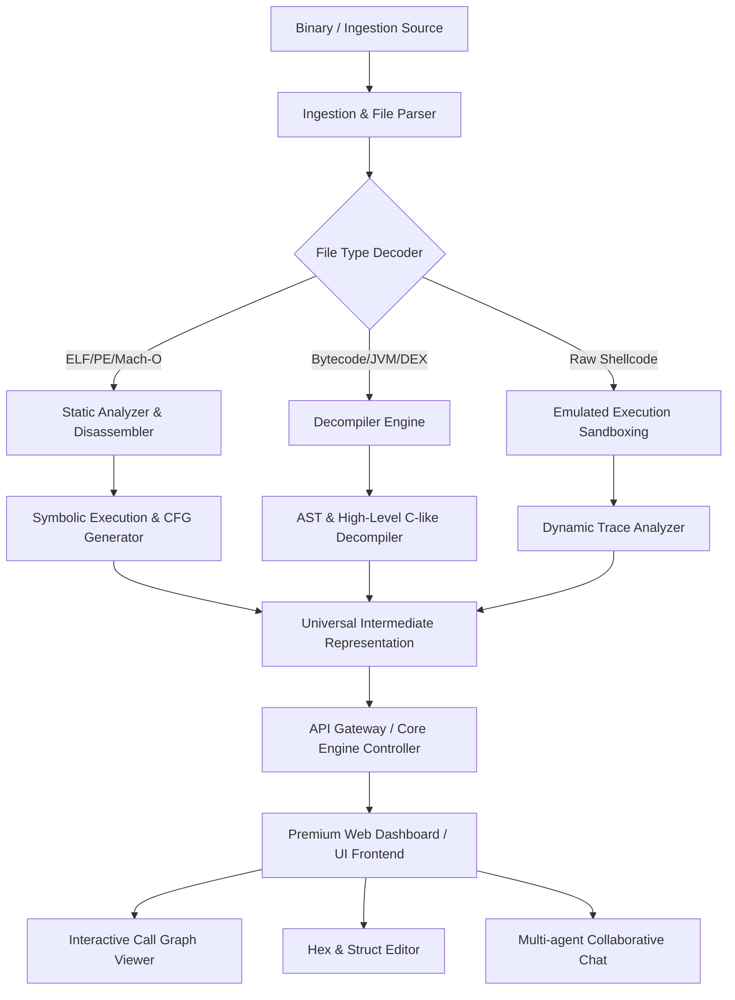

# 🌌 Universal Reverse Engineering Tool (URET)

A next-generation, premium web-based workbench designed for security researchers, malware analysts, and reverse engineers. Built for speed, visual clarity, and multi-threaded analytical workflows.

---

## 🛠️ Architecture Flowchart

Below is the conceptual high-level architecture of URET, illustrating how files flow from binary ingestion through our disassembler and analysis engines to the interactive visual frontend.



---

## ✨ Features Breakdown

### 1. Unified Binary Ingestion & Parsing
*   **Multi-Format Loader:** Built-in support for executable formats including **PE (Windows)**, **ELF (Linux)**, **Mach-O (macOS)**, and raw shellcode.
*   **Automatic Metadata Extraction:** Extracts headers, section configurations, imports/exports, dynamic libraries, and compilation footprints immediately on upload.

### 2. High-Performance Static Disassembly & Decompilation
*   **Control Flow Graph (CFG) Reconstruction:** Renders beautiful interactive visual flowcharts showing jumps, branches, loops, and block execution paths.
*   **Interactive Type and Symbol Renaming:** Rename variables, structs, and functions globally in real time with immediate propagation across the decompiled view.
*   **Expanded Instruction Tables:** Upgraded [router.ts](file:///C:/Users/NaThA/hacks/antigravity_things/agy/test/src/disassembler/router.ts) disassembler with comprehensive instruction mappings:
    *   **x86_64**: Added `adc`, `sbb`, 8-bit arithmetic instructions (`add`, `or`, `adc`, `sbb`, `and`, `sub`, `xor`, `cmp`), `CMOVcc` conditional moves, `bsf`/`bsr` bit scans, and the `ud2` undefined instruction.
    *   **ARM AArch64**: Added logical negations (`orn`, `bic`, `eon`, `mvn`, `bics`, `ands`), division (`sdiv`, `udiv`), and multiply instructions (`madd`, `msub`, `mul`, `mneg`).

### 3. Intermediate Representation (IR) & SSA Framework
*   **Target-Independent IR:** Located in [ir.ts](file:///C:/Users/NaThA/hacks/antigravity_things/agy/test/src/disassembler/ir.ts), translates target-dependent machine instructions/blocks to uniform intermediate operations (e.g., `ADD`, `SUB`, `LOAD`, `STORE`, `BRANCH`, `PHI`).
*   **SSA Form & Optimization:** Automatically constructs Static Single Assignment (SSA) form with variables versioned across block boundaries.
*   **Cycle Detection & Loop Prevention:** Incorporates a robust visited-set tracking mechanism inside SSA copy propagation to eliminate recursion loops.

### 4. Plugin Architecture
*   **Extensible Analyzer Framework:** Located in [plugins.ts](file:///C:/Users/NaThA/hacks/antigravity_things/agy/test/src/analyzer/plugins.ts), allows external analyzers to run logic against the disassembled codebase.
*   **Structured Context & Findings:** Exposes `AnalyzerContext` (binary data, sections, symbols, and instructions) to plugins and returns structured `AnalyzerResult` containing detailed metadata and severity-tagged findings.

### 5. Dynamic Emulation & Sandbox Analysis
*   **Step-by-Step Micro-Emulation:** Step through instructions without setting up complex debugger attaches, executing code safely inside a sandbox environment.
*   **Register & Memory Visualizer:** Live track registers (e.g., EAX/RAX, RSP, RIP) and memory stack modifications in a beautiful interactive UI panel.

### 6. Advanced Hex & Structure Editor
*   **Semantic Color Highlighting:** Instantly highlights headers, sections, code cavities, and strings.
*   **Structure Alignment Overlay:** Map custom C/C++ structs over raw binary offsets to inspect and edit complex nested objects visually.

---

## 🧪 Testing & Quality Audits

### E2E DOM Integration Suite
*   **JSDOM Integration:** The comprehensive test suite [e2e.test.ts](file:///C:/Users/NaThA/hacks/antigravity_things/agy/test/tests/e2e.test.ts) renders and tests the interface elements inside a full JSDOM mock environment.
*   **Environment Mocks:** Standardized mocks for `ResizeObserver`, canvas layout measurements via a proxy `CanvasRenderingContext2D`, `scrollIntoView`, and clipboard interactions.
*   **Core Flow Validation:** Automatically verifies the UI layout structures, default sample ELF binary loading, panel tab switching, and sidebar symbol filter search matching.

### Performance & Coverage Audits
*   **Performance Audit:** Analyzed visualizer panel DOM layout pressure and identified memory leak vectors in [cfgVisualizer.ts](file:///C:/Users/NaThA/hacks/antigravity_things/agy/test/src/ui/cfgVisualizer.ts) and [fcgVisualizer.ts](file:///C:/Users/NaThA/hacks/antigravity_things/agy/test/src/ui/fcgVisualizer.ts) from uncleaned global window event listeners.
*   **Test Coverage Audit:** Audited coverage across the workspace using `@vitest/coverage-v8`, establishing baseline coverage (Statements: 71.71%, Branches: 55.86%, Functions: 70.61%, Lines: 72.84%) and listing critical path enhancements for memory mapping, PE parsers, and disassembler router components.

---

## 🚀 Getting Started

Ensure you have Node.js installed on your system. This project strictly uses **pnpm** for package management.

### Installation

Clone the repository and install all required dependencies:

```bash
# Clone the repository
git clone <repository-url>
cd test

# Install dependencies using pnpm
pnpm install
```

### Running the App Locally

To start the development server with Hot Module Replacement (HMR):

```bash
pnpm run dev
```

### Running Test Suite

To run all disassembler, parser, analyzer, E2E, and regression tests:

```bash
pnpm test
```

### Production Build

To build the static application bundle optimized for deployment:

```bash
pnpm run build
pnpm run preview
```

---

## 🎯 Next Goals & Roadmap

- [ ] **Interactive WebAssembly Decompiler:** Direct support for decompiling `.wasm` binaries into high-quality human-readable C-like syntax.
- [ ] **Collaborative Multi-User Workspace:** Real-time live collaboration allowing multiple reverse engineers to rename symbols, comment on instructions, and annotate CFG blocks simultaneously.
- [ ] **AI-Assisted Code Explainer:** Integrated local model support to explain complex assembly blocks, detect cryptographic algorithms, and summarize vulnerability entry-points automatically.
- [ ] **Extended Emulation Sandbox:** Emulate Windows API and Linux syscalls directly in the browser to log malware file writes, registry changes, and network connection attempts.

---

*Crafted with 💜 for Security Researchers.*
