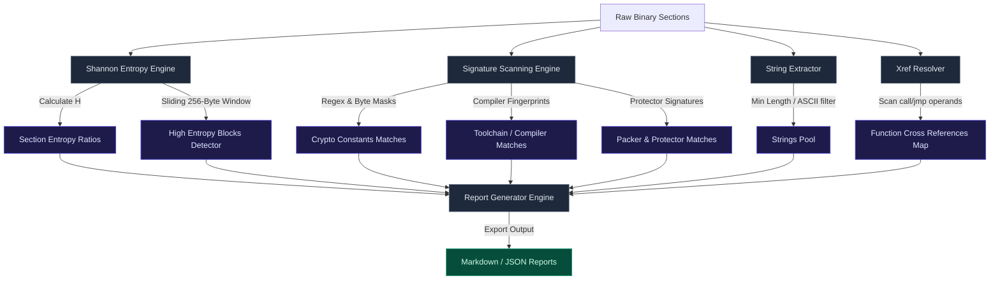

# 📊 Static Analyzers (Entropy, Signatures, Search)

DISSECT is equipped with a suite of static analysis tools that extract characteristics from binary files, aiding reverse engineers in malware triage, unpacker detection, and cryptographic discovery.

---

## 📈 Static Analyzer Workflows

---

## 🔬 Analyzer Subsystems

### 📉 1. Shannon Entropy Calculator
The entropy engine ([entropy.ts](file:///C:/Users/NaThA/hacks/antigravity_things/agy/test/src/analyzer/entropy.ts)) calculates Shannon entropy to evaluate byte-level information density.

#### Shannon Entropy Formula
For a given byte sequence, the entropy $H$ is computed as:
$$H = -\sum_{i=0}^{255} P(x_i) \log_2 P(x_i)$$
Where $P(x_i)$ is the frequency of occurrence of byte value $x_i$ in the file.
*   **Scale**: Values range between `0.0` (all bytes are identical) and `8.0` (all 256 byte values are uniformly distributed).
*   **Packed/Encrypted Detection**: Sections with entropy values $> 7.2$ generally indicate compressed or encrypted payloads.
*   **Sliding Window Scan**: Uses a sliding window (commonly 256 bytes wide, shifting by 64-byte increments) to spot small enclaves of high entropy within otherwise flat code regions (e.g. embedded payloads or inline shellcode).

### 🏷️ 2. Signature Scanner
The signature engine ([signatures.ts](file:///C:/Users/NaThA/hacks/antigravity_things/agy/test/src/analyzer/signatures.ts)) scans the binary for known byte sequences.
*   **Compile Signatures**: Identifies build systems and runtimes (e.g. GCC, MSVC, Clang, Go, Rust).
*   **Packer & Protector Signatures**: Flags packing layers (e.g. UPX, Themida, VMProtect).
*   **Cryptographic Key Matches**: Detects predefined array patterns for standard algorithms:
    *   **AES**: S-Box vectors.
    *   **MD5 / SHA-256**: Initialization constants.
    *   **RC4**: Permutation indexes.
*   **Category Sorting**: Matches are sorted into `compiler`, `packer`, `crypto`, and `other` tags, and mapped back to virtual addresses using the loaded section headers.

### 🧵 3. String & Xref Extractors
*   **String Analyzer** ([strings.ts](file:///C:/Users/NaThA/hacks/antigravity_things/agy/test/src/analyzer/strings.ts)): Inspects binary pages to find continuous blocks of printable characters (ASCII or UTF-8). It filters entries below a configurable length threshold (e.g., minimum 4 characters) and indexes their byte locations.
*   **Xref Analyzer** ([xrefs.ts](file:///C:/Users/NaThA/hacks/antigravity_things/agy/test/src/analyzer/xrefs.ts)): Scans decoded instruction blocks looking for target destination addresses. It constructs a dictionary mapping memory addresses to references (who calls who), allowing developers to quickly check where a string or function is utilized.

### 📝 4. Report Generator
The report coordinator ([reportGenerator.ts](file:///C:/Users/NaThA/hacks/antigravity_things/agy/test/src/analyzer/reportGenerator.ts)) aggregates analysis output into unified formats:
*   **JSON Report**: Exportable schema containing structured lists of section entropy ratios, signature match offsets, symbols, and extracted strings.
*   **Markdown Report**: A formatted report summarizing imports/exports, highest entropy blocks, packer warnings, and signature summaries.
