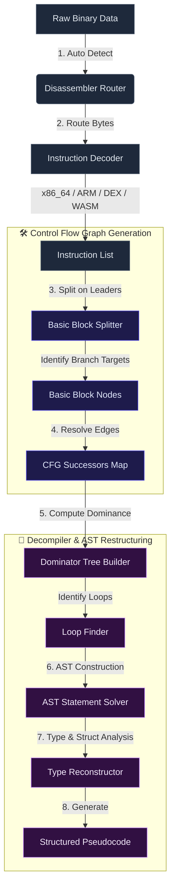

# ⚙️ Disassembler Router & Control Flow Graphs

DISSECT utilizes a multi-stage disassembly and control-flow analysis pipeline. This document explains how raw binaries are translated into structured instructions, grouped into basic blocks, arranged in a control-flow graph (CFG), and decompiled.

---

## 📈 Disassembly & Decompilation Pipeline



---

## 🔀 1. Disassembler Router & Auto-Detection
The `DisassemblerRouter` ([router.ts](file:///C:/Users/NaThA/hacks/antigravity_things/agy/test/src/disassembler/router.ts)) is the central entry point for byte-to-instruction conversion.
*   **Signature Matching**: First performs magic signature detection on raw byte arrays (e.g. searching for `dex\n`, `\0asm`, `\x7fELF`, etc.).
*   **Bitness & Endianness Parsing**: Reads header segments to establish instruction alignment (32-bit or 64-bit offsets) and endianness layout.
*   **Decoder Delegation**: Dispatches bytecode segments to specialized instruction decoders:
    *   **x86_64**: Decodes opcode fields, ModR/M and SIB bytes, prefix prefixes (REX, operand overrides), and resolves immediate operands or relative jumps.
    *   **ARM / ARM64**: Decodes fixed-width 32-bit instructions (shifts, branch offsets, memory load/stores).
    *   **DEX**: Decodes Dalvik opcodes (e.g. `move`, `return-void`, `const/4`, `invoke-virtual`).
    *   **WASM**: Parses WASM byte streams into stack-machine operations (e.g. `i32.const`, `local.get`, `call`, `br_if`).

---

## ⛓️ 2. Control Flow Graph (CFG) Construction
The `CFGBuilder` ([cfg.ts](file:///C:/Users/NaThA/hacks/antigravity_things/agy/test/src/disassembler/cfg.ts)) processes flat arrays of `Instruction` objects to generate basic blocks.

### Basic Block Splitting Algorithm
A **Basic Block** is a sequence of instructions containing a single entry point (the first instruction) and a single exit point (the last instruction). The builder splits instructions using the following **Leaders Rules**:
1.  The very first instruction of the function is a leader.
2.  Any instruction that is the target of a conditional or unconditional branch is a leader (e.g. jump destination offsets).
3.  Any instruction that immediately follows a conditional or unconditional branch instruction is a leader.

### Successor Resolution
After splitting the instructions at leader boundaries into individual blocks, the builder resolves the execution flow edges (**Successors**):
*   **Unconditional Jumps (`JMP` / `br`)**: Link to the target block.
*   **Conditional Jumps (`Jcc` / `br_if`)**: Link to both the target block and the fall-through block (the next physical block).
*   **Call/Return (`CALL` / `RET` / `return-void`)**: Unconditional exit nodes (`RET`) have zero successors. Calls are treated as sequential, branching inside but returning immediately to the fall-through instruction block.

---

## 🧩 3. Decompiler & AST Restructuring
The decompiler ([decompiler.ts](file:///C:/Users/NaThA/hacks/antigravity_things/agy/test/src/disassembler/decompiler.ts)) reconstructs high-level structures from the flat, graph-based representation:

### Dominator Trees
To understand block relationships, the decompiler constructs dominator structures:
*   A node $A$ **dominates** a node $B$ ($A \text{ dom } B$) if every path from the entry node to $B$ must pass through $A$.
*   **Immediate Dominator (IDom)**: The unique node $A$ that dominates $B$ directly without dominating any other dominators of $B$.
*   **Dominance Frontiers**: The set of nodes where dominance ceases. This determines where variables must merge or conditional branch blocks close.

### Loop Detection
The decompiler identifies loops by searching for **Back-Edges** (an edge $A \rightarrow B$ where $B$ dominates $A$).
*   $B$ is identified as the loop header.
*   The loop body consists of all nodes that can reach $A$ without passing through $B$.
*   Loop blocks are restructured into structured `While` or `DoWhile` AST nodes.

### AST Node Translation
The decompiler maps blocks to an Abstract Syntax Tree (AST):
*   **Statements**: Translates instruction operands (like `MOV rax, rbx`) into clean assignments (`rax = rbx;`).
*   **Conditional Branches (`If` / `Else`)**: Translates block splitting into structured statements:
    ```typescript
    if (condition) {
        // thenBranch
    } else {
        // elseBranch
    }
    ```
*   **Type & Struct Inference**: Inspects offset references (e.g. `[rsi + 0x10]`) to reconstruct custom structure layout maps and datatypes. If sequential writes are made to contiguous offsets of a base pointer, they are represented as typed fields of a resolved `struct` type:
    ```typescript
    struct_0.field_16 = rax;
    ```
