# 🧠 Virtual CPU Emulator State & Memory Model

DISSECT integrates a virtual CPU emulator capable of executing compiled instructions step-by-step. The engine is divided into three core parts: CPU register banks, page-aligned virtual memory, and the interpreter execution loop.

---

## 📈 Emulator Model Diagram

Below is the layout of the CPU State, Virtual Memory, and Instruction Execution Pipeline.

```mermaid
graph TD
    %% Register Bank
    subgraph RegisterBank ["💻 CPU Register Banks (cpu.ts)"]
        subgraph GPR ["64-Bit GPRs"]
            RAX[rax / eax / ax / ah / al]
            RBX[rbx / ebx / bx / bh / bl]
            RCX[rcx / ecx / cx / ch / cl]
            RDX[rdx / edx / dx / dh / dl]
            RSI[rsi / esi / si / sil]
            RDI[rdi / edi / di / dil]
            RSP[rsp / esp / sp / spl]
            RBP[rbp / ebp / bp / bpl]
            R8["r8 / r8d / r8w / r8b"]
            R15["r15 / r15d / r15w / r15b"]
        end
        RIP[Instruction Pointer: rip]
        RFLAGS[Flags: rflags ZF / CF / SF / OF]
    end

    %% Memory Map
    subgraph VirtualMemory ["🧠 Page-Aligned Virtual Memory (memory.ts)"]
        direction TB
        PageTable["Memory Pages (Page Size: 4096 bytes)"]
        Regions["Mapped Regions Table"]
        
        Regions -->|Region 1| TEXT[".text - Read/Execute"]
        Regions -->|Region 2| DATA[".data - Read/Write"]
        Regions -->|Region 3| STACK["[stack] - Read/Write"]
        
        PageTable -->|Lookup physical index| Pages[Allocated Uint8Array chunks]
    end

    %% Interpreter Loop
    subgraph Interpreter ["⚙️ Instruction Interpreter Loop (emulator.ts)"]
        Fetch[1. Fetch Instruction at rip] --> Decode[2. Parse Opcode & Operands]
        Decode --> AddressResolve{Memory Operand?}
        AddressResolve -->|Yes: base + index * scale + disp| MemCheck[3. Verify Memory Permissions]
        MemCheck --> DecodeExec[4. Execute Instruction Logic]
        AddressResolve -->|No| DecodeExec
        DecodeExec --> WriteBack[5. Update Registers / Flags]
        WriteBack --> BreakpointCheck{Breakpoint Hit?}
        BreakpointCheck -->|Yes| Halt[Halt Execution]
        BreakpointCheck -->|No| StepNext[Advance rip / Loop]
    end

    classDef reg fill:#1E293B,stroke:#475569,stroke-width:1px,color:#E2E8F0;
    classDef mem fill:#1e1b4b,stroke:#4f46e5,stroke-width:1px,color:#e0e7ff;
    classDef exec fill:#064E3B,stroke:#059669,stroke-width:1px,color:#D1FAE5;

    class RAX,RBX,RCX,RDX,RSI,RDI,RSP,RBP,R8,R15,RIP,RFLAGS reg;
    class PageTable,Regions,TEXT,DATA,STACK,Pages mem;
    class Fetch,Decode,AddressResolve,MemCheck,DecodeExec,WriteBack,BreakpointCheck,Halt,StepNext exec;
```

---

## 💻 1. CPU Register Banks & Sub-Register Aliasing
The `CPU` class ([cpu.ts](file:///C:/Users/NaThA/hacks/antigravity_things/agy/test/src/emulator/cpu.ts)) manages 64-bit general-purpose registers (GPRs). In x86_64 architecture, smaller registers map to sub-sections of larger registers. DISSECT simulates this behavior using the following rules:

### Aliasing Layout
*   **32-Bit Register Write (e.g. `eax`)**: Zero-extends. The entire upper 32 bits of the parent register (`rax`) are cleared.
*   **16-Bit Register Write (e.g. `ax`)**: Preserves. The upper 48 bits of the parent register are preserved. Only the lower 16 bits are updated.
*   **8-Bit Low Register Write (e.g. `al`, `r8b`)**: Preserves. The upper 56 bits are preserved. Only the lowest byte is updated.
*   **8-Bit High Register Write (e.g. `ah`)**: Preserves. Accesses bits 8–15 of the parent register. The surrounding bits are preserved.

### Register Maps
*   `rax`, `rcx`, `rdx`, `rbx`, `rsp`, `rbp`, `rsi`, `rdi`
*   `r8` through `r15`
*   `rip` (Instruction Pointer)
*   `rflags` (Status Flags: Zero Flag `ZF`, Carry Flag `CF`, Sign Flag `SF`, Overflow Flag `OF`)

---

## 🧠 2. Page-Aligned Memory Model
The `VirtualMemory` class ([memory.ts](file:///C:/Users/NaThA/hacks/antigravity_things/agy/test/src/emulator/memory.ts)) provides paging capabilities.
*   **Page Structures**: Keeps memory inside a map of page chunks. Page size is locked to `4096` bytes. This prevents allocating huge, continuous byte arrays.
*   **Segment Mapping**: Sections of parsed binaries are loaded into specific base virtual addresses.
*   **Permissions Matrix**: Every memory segment is assigned explicit permissions:
    *   `Read` (R): Permission to read bytes.
    *   `Write` (W): Permission to modify bytes.
    *   `Execute` (X): Permission to execute instructions.
*   **Strict Access Control**: Reading, writing, or executing outside mapped regions, or invoking operations that breach permissions (e.g., executing code in stack segments, or writing to read-only `.text`), will throw a `MemoryAccessError`.
*   **Endian-Aware APIs**: Provides helper functions to read and write integers of varying widths:
    *   `read8(addr)`, `write8(addr, val)`
    *   `read16(addr)`, `write16(addr, val)` (Little Endian)
    *   `read32(addr)`, `write32(addr, val)` (Little Endian)
    *   `read64(addr)`, `write64(addr, val)` (Little Endian)

---

## ⚙️ 3. Instruction Interpreter & Execution Loop
The `Emulator` class ([emulator.ts](file:///C:/Users/NaThA/hacks/antigravity_things/agy/test/src/emulator/emulator.ts)) connects the register state with virtual memory:

### Operand Address Resolution
For memory access expressions (e.g. `[base + index * scale + displacement]`), the emulator resolves addresses dynamically:
$$\text{Resolved Address} = \text{Reg}[base] + (\text{Reg}[index] \times scale) + displacement$$
*Example*: `[rsi + rdi * 4 + 0x20]` queries register values `rsi`, `rdi`, multiplies `rdi`'s value by 4, adds `0x20`, and accesses that memory address.

### Supported Operations
The interpreter loop supports execution of:
*   `MOV`: Copy data between registers and memory.
*   `ADD` / `SUB` / `XOR` / `CMP`: Update values and set flags (e.g. `ZF` if result is zero, `SF` if negative).
*   `PUSH` / `POP`: Update the stack pointer (`rsp`) and read/write values to/from virtual stack pages.
*   `CALL` / `RET`: Standard function invocation. `CALL` pushes the return address and jumps to the function. `RET` pops it back to `rip`.
*   `JMP` / `Jcc` (e.g., `JE`, `JNE`, `JZ`, `JNZ`): Conditional and unconditional jumps by reading `rflags` states.
*   `LEA`: Loads calculated effective address directly into a target register without querying the memory page.

### Execution Control
*   `step()`: Executes a single instruction at `rip`, updates flags/registers, and moves `rip` forward.
*   `run()`: Runs continuously until a breakpoint is hit, the instruction count threshold is exceeded, or a CPU halt is reached.
*   `addBreakpoint(address)` / `removeBreakpoint(address)`: Registers debugger stop triggers.
