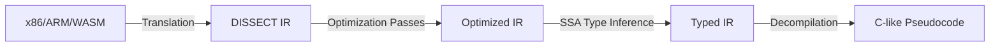

# 🗺️ DISSECT Roadmap Proposals & Research Document

This document outlines the strategic research proposals and advanced feature roadmap to elevate DISSECT (Universal Reverse Engineering Tool) into a enterprise-grade, premium collaborative reverse engineering workbench.

---

## 1. Dynamic Analysis & Debugger Integration
To move DISSECT from a static-heavy analyzer to a live interactive workbench, we propose building a unified debugger frontend supporting remote execution agents.

### A. GDB/LLDB Remote Serial Protocol (RSP) Client
*   **Architecture**: Implement a pure TypeScript WebSocket-to-TCP bridge service or directly support browser-based WebTransport connections to communicate with remote `gdbserver` or `lldb-server`.
*   **Capabilities**:
    *   Reading and writing target memory and registers dynamically.
    *   Software & hardware breakpoint placement linked directly to the **Assembly View**.
    *   State synchronization: Stepping in the debugger highlights the current instruction pointer (`rip`/`pc`) in both the Assembly and the **Control Flow Graph (CFG)** views.
    *   Stack frame unwinding and register-state diffing.

### B. Dynamic Binary Instrumentation (DBI) Integration (Frida)
*   **Architecture**: Integrate an agent runner that interacts with local/remote Frida daemons.
*   **Capabilities**:
    *   Live function hooking: Let users right-click a resolved symbol in the **Imports/Exports Panel** and select "Trace calls".
    *   Automated telemetry: Capture argument values, return codes, and heap allocations at runtime and pipe them into a live logging panel.
    *   In-memory script execution: Allow writing custom Javascript hooks directly inside the **Scripting Console** to modify arguments or bypass authentication checks on-the-fly.

---

## 2. Deeper File Format Support
Expanding DISSECT's parsing capabilities to unlock hidden executable metadata, compile structures, and raw firmware offsets.

### A. Resource Parsing & Deeper Formats
*   **Windows PE Resource (`.rsrc`) Extraction**: Parse the PE resource directory tree to extract icons, manifests, version info, dialog templates, and embedded payloads (e.g., secondary malware stages).
*   **PDB & DWARF Debug Symbol Recovery**: Read debug info sections (like `.debug_info`, `.debug_line` in ELF, or external PDB streams) to reconstruct original variable names, structures, source line mappings, and source file hierarchies.
*   **Objective-C Metadata Recovery**: In Mach-O, parse `__objc_classname`, `__objc_methname`, `__objc_methtype`, and class lists to automatically label Swift/Obj-C class signatures, interfaces, and dispatch paths.
*   **Java/.NET Decompilation Core**: Native MSIL/.NET metadata table parser and CIL instruction decompiler to complement DEX and WASM.

### B. Nested Archiving & Automatic Unpacking
*   **Multi-Archive Ingestion**: Auto-extract ZIP, APK, JAR, and IPA files on upload.
*   **Universal Decapsulator**: Detect nested file structures, unpack them recursively, and present them in a virtual filesystem panel inside the workspace.

---

## 3. Intermediate Representation (IR) & Decompiler Optimizations
A formal IR framework will unify analysis across architectures (x86_64, AArch64, WASM, Dalvik) and yield cleaner C-like pseudocode.

### A. DISSECT IR (DIR) Specification
*   Define a strict Single Static Assignment (SSA) based IR. Every instruction maps to target-independent micro-operations (e.g., `ADD`, `SUB`, `LOAD`, `STORE`, `PHI`, `BRANCH`).
*   **SSA Form Translation**: Convert registers and variables to versioned SSA representations to track data flow precisely.

### B. Optimization Pipelines
*   **Constant Folding & Propagation**: Simplify complex address calculations and pointer arithmetic.
*   **Dead Store & Code Elimination**: Remove redundant compiler artifacts (e.g., unused flag calculations).
*   **Type Recovery Engine**: Implement a constraint-based type solver to reconstruct structs, unions, and nested arrays by tracking how pointer displacements and sizes are accessed in memory loop patterns.

---

## 4. Robust Extensibility & Plugin Architecture
To foster a community ecosystem, DISSECT requires a standardized plugin system enabling users to customize the workbench.

### A. Plugin Lifecycle & API
*   Expose a global `dissect` JavaScript namespace containing:
    *   `dissect.workspace`: APIs to read parsed binary files, write patches, or load symbols.
    *   `dissect.ui`: Hooks to register custom sidebars, tabs, menu items, or inject custom SVG/Canvas elements.
    *   `dissect.emulator`: Hooks to subscribe to CPU step events or override memory access callbacks.
*   **Sandboxed Execution**: Run plugins in a Web Worker or light iframe sandbox to ensure workspace stability.

### B. Scriptable Hook Hooks & Automation
*   Enable scripts to run headlessly for batch scanning (e.g., running signature matches on 100 binaries and outputting JSON reports).

---

## 5. Collaborative Workspaces & Cloud Offloading
Enabling modern, real-time collaboration features for distributed security teams.

### A. CRDT-Based Collaboration
*   Utilize Conflict-free Replicated Data Types (CRDTs, e.g., Yjs) synced via WebSockets or WebRTC to enable concurrent workspaces.
*   **Simultaneous Annotations**: Let multiple analysts highlight basic blocks in the **CFG View**, rename variables in the **Decompiler**, and append comments in the **Assembly View** in real time.

### B. Headless Engine Offloading
*   Allow connecting the UI to a powerful backend worker (Node.js/Go) hosted in a cloud environment.
*   Offload parsing, heavy symbol indexing, control-flow graph building, and emulation of massive binaries (>500MB) to the remote backend, serving only visible viewport segments to the browser client.

---

## 6. Advanced Local AI & Vulnerability Detection
Integrating local LLM intelligence directly within the browser using hardware-accelerated WebGPU pipelines.

### A. On-Device LLM Execution
*   Deploy small, specialized models (e.g., Qwen-2.5-Coder-1.5B or Phi-3-medium) locally using WebNN or ONNX Runtime Web.
*   **Off-grid Analysis**: Maintain 100% data privacy by keeping all disassembled binary code entirely local to the user's browser.

### B. Semantic Context & Vulnerability Auditing
*   **Vulnerability Detection Patterns**: Train pattern matchers to detect unsafe API usage (e.g., `strcpy`, `sprintf`), potential buffer overflows, and integer overflows.
*   **Automatic Function Summarization**: Generate natural language explanations for complex block structures, cryptographic setups, and anti-debugging tricks.
